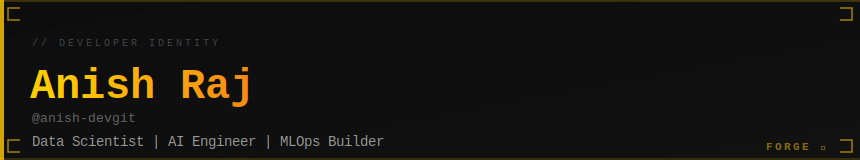
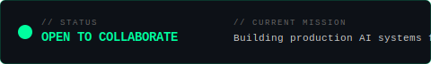
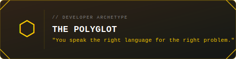
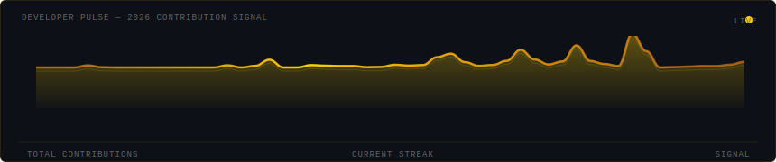
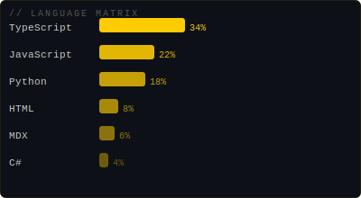

<!--
  ██████████████████████████████████████████████████████████
  ██                                                      ██
  ██   FORGE — Developer Identity Engine                  ██
  ██   Auto-generated by github.com/your-username/FORGE   ██
  ██   Last updated: 2026-03-14 00:36 UTC              ██
  ██                                                      ██
  ██████████████████████████████████████████████████████████
-->

<div align="center">



</div>

---

<div align="center">



</div>

<br/>

## `> IDENTITY`

```
NAME     : Anish Raj
HANDLE   : @anish-devgit
MISSION  : Data Scientist | AI Engineer | MLOps Builder
ARCHETYPE: ⬡ The Polyglot
```

<div align="center">



**Power:** Cross-paradigm problem solving · **Shadow:** Context-switching cost

</div>

---

## `> DEVELOPER PULSE`

*Your 2026 contribution signal — 800 total events recorded*

<div align="center">



</div>

---

## `> STATS`

<div align="center">


&nbsp;&nbsp;


</div>

---

## `> TECH_MATRIX`

<div align="center">



</div>

**Primary Languages:** `TypeScript` · `JavaScript` · `Python` · `HTML` · `MDX`

---

### `> MISSION_LOG.tail(4)`

| Repository | Description | Lang | Stars | Forks | Updated |
|:-----------|:------------|:-----|:------|:------|:--------|
| `awesome-chatgpt-prompts` | Share, discover, and collect prompts from the community. Free and | `HTML` | ⭐ 0 | 🍴 0 | today |
| `intelligent-business-agent` | An intelligent AI-powered agent that goes beyond a traditional ch | `MDX` | ⭐ 0 | 🍴 0 | 10d ago |
| `MunafaFlow` | 🚀 India's WhatsApp-first conversational commerce builder. Automat | `TypeScript` | ⭐ 0 | 🍴 0 | 13d ago |
| `mistral-vibe` | Minimal CLI coding agent by Mistral | `Python` | ⭐ 0 | 🍴 0 | 30d ago |

> *Auto-updated by FORGE every 24h*

---

## `> OPEN SOURCE KARMA`

**FORGE Karma:** `738` — `CONTRIBUTOR`

| Metric | Count |
|:-------|------:|
| Commits (last year) | `611` |
| Pull Requests | `15` |
| External Contributions | `4` |
| PR Reviews | `4` |
| Stars Earned | `23` |
| Issues Closed | `6` |

---

## `> CONNECT`

[🌐 Website](https://github.com/anish-devgit) · [💼 LinkedIn](https://linkedin.com/in/er-anish)

> *"The best developers I know are students first."*

---

<div align="center">

**Built with [FORGE](https://github.com/anish-devgit/FORGE)** — *The Developer Identity Engine*


*README auto-regenerated daily · Last update: `2026-03-14 00:36 UTC`*

</div>
